# **빌드 및 배포**

### 버전

- frontend
  - Vue.js: 2.9.6
- backend
  - Java : 11
  - Spring boot : 2.6.7
- database
  - mysql : 8.0.29
  - mongoDB: 5.0.8
- infra
  - nginx: 1.18.0
  - jenkin: **[Jenkins 2.332.3](https://www.jenkins.io/)**

### 포트

- frontend : 80
- backend : 8081
- backend_chat : 8082
- database
  - mysql : 3306
  - mongoDB : 27017
- infra
  - jenkins : 9090

### 배포

1. Jenkinsfile

   해당 깃 메인 페이지의 Jenkinsfile을 Jenkins의 Pipeline-Script에 작성한다.

2. nginx 설정 파일

   https 설정과 프론트에서 백엔드로 보내는 요청을 분산하기 위한 nginx 설정을 위해 `sudo vi /etc/nginx/sites-available/default` 명령어를 치고 아래의 내용을 작성한다.

   ```java
   
   server {
   
           root /var/www/woonana/dist;
   
           index index.html index.htm index.nginx-debian.html;
   
           server_name k6b104.p.ssafy.io;
   
           listen [::]:443 ssl ipv6only=on; # managed by Certbot
           listen 443 ssl; # managed by Certbot
           ssl_certificate /etc/letsencrypt/live/k6b104.p.ssafy.io/fullchain.pem; # managed by Certbot
           ssl_certificate_key /etc/letsencrypt/live/k6b104.p.ssafy.io/privkey.pem; # managed by Certbot
           include /etc/letsencrypt/options-ssl-nginx.conf; # managed by Certbot
           ssl_dhparam /etc/letsencrypt/ssl-dhparams.pem; # managed by Certbot
   
           location / {
                   root /var/www/woonana/dist;
                   try_files $uri $uri/ /index.html;
           }
   
           location /api {
                   proxy_pass http://localhost:8081;
                   proxy_set_header X-Real-IP $remote_addr;
                   proxy_set_header X-Forwarded-For $proxy_add_x_forwarded_for;
                   proxy_set_header Host $http_host;
           }
   
           location /chatapi {
                   proxy_pass http://localhost:8082;
                   proxy_set_header X-Real-IP $remote_addr;
                   proxy_set_header X-Forwarded-For $proxy_add_x_forwarded_for;
                   proxy_set_header Host $http_host;
           }
   
           location /wss {
                   proxy_pass http://localhost:8082/ws;
                   proxy_set_header X-Real-IP $remote_addr;
                   proxy_set_header X-Forwarded-For $proxy_add_x_forwarded_for;
                   proxy_set_header Host $http_host;
   
                   proxy_http_version 1.1;
                   proxy_set_header Upgrade $http_upgrade;
                   proxy_set_header Connection "upgrade";
   
           }
   }
   
   server {
       if ($host = k6b104.p.ssafy.io) {
           return 301 https://$host$request_uri;
       } # managed by Certbot
   
           listen 80 default_server;
           listen [::]:80 default_server;
   
           server_name k6b104.p.ssafy.io;
       return 404; # managed by Certbot
   
   }
   ```

   &nbsp;

# **외부 서비스 정보**

### [카카오 로그인 기능](https://developers.kakao.com/docs/latest/ko/kakaologin/common)

### **[AWS S3](https://aws.amazon.com/ko/s3/)**

&nbsp;

# **시연 시나리오**

* 
  * 로그인 버튼을클릭하면 카카오톡으로 로그인이 됩니다.	

* 
  * 메인페이지 '게시판'입니다. 참여하고싶은 운동에 참가하세요!!!!

* 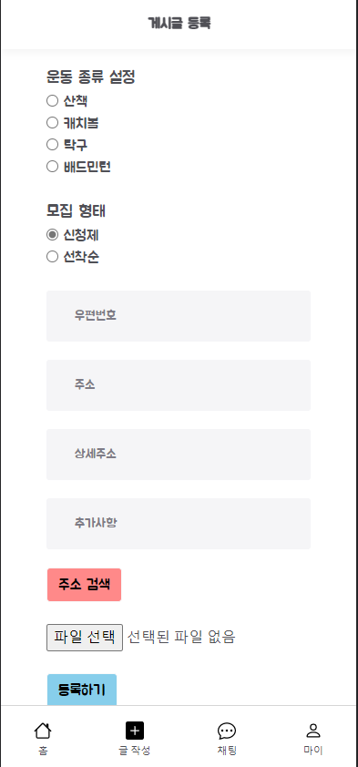
  * 게시글 등록입니다. 사진과 운동할 장소 그리고 모집형태를 선택해서 크루를 모집할 수 있습니다.

* 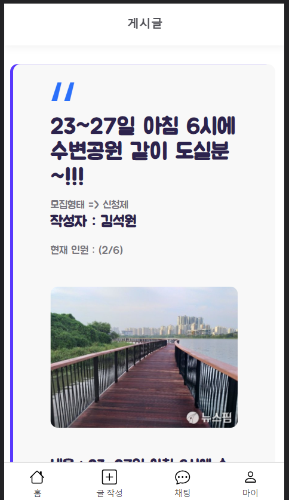
  * 게시글 상세페이지입니다.
  * 참여자 목록, 신청자 목록을 확인할수 있으며 신청자들을 대상으로 채팅방을 개설해 채팅 할 수 있습니다.

* 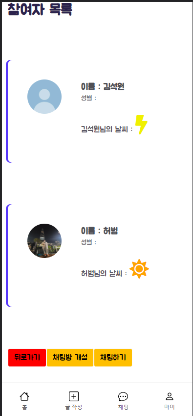
* 참여자 목록입니다. 각자의 매너날씨가 표시되며 채팅방을 개설하여 채팅이 가능합니다.

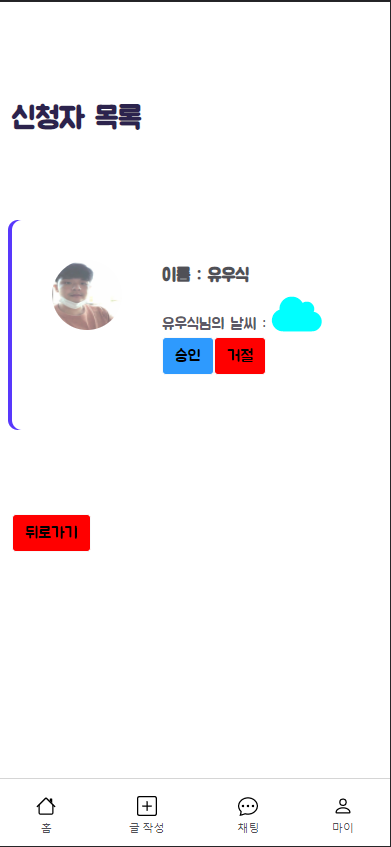

* 신청자목록입니다. 여기서 신청자의 이름과 매너날씨가 보이고 승인/거절을 선택할 수 있습니다.

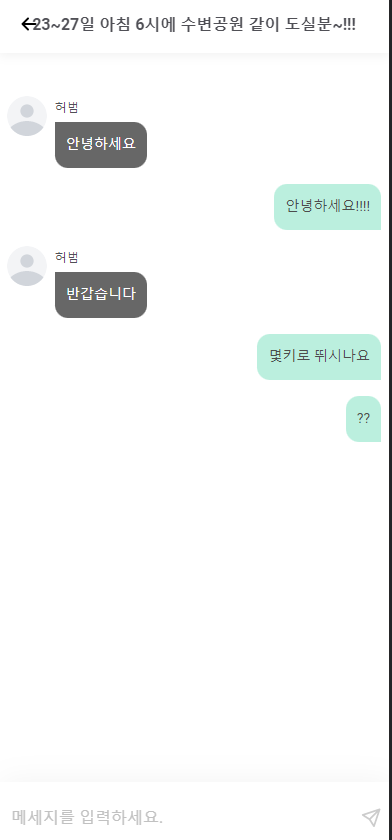

* 참여자와 채팅기능입니다. 여기서 참가자들과 채팅을 할 수 있습니다.

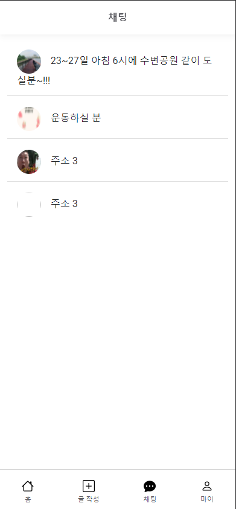

* 채팅목록입니다. 클릭해서 운동글 별 채팅을 할 수 있습니다.


* 마이페이지 내가쓴 글입니다. 내가 쓴 글을 확인할 수 있습니다.

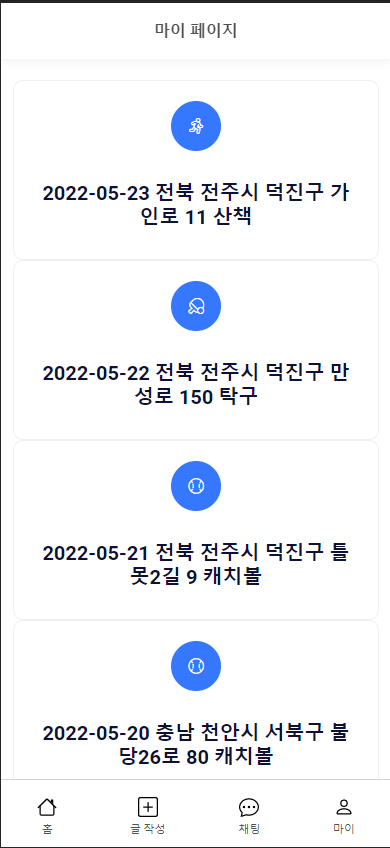

* 마이페이지 참여목록입니다. 지금까지 참가했던 운동기록을 확인할 수 있습니다.

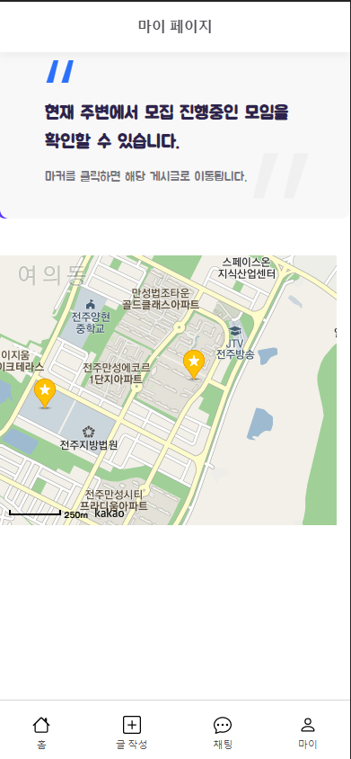

* 마이페이지 운하나 지도기능입니다. 근처에서 모집중인 운동크루를 확인할 수 있습니다.

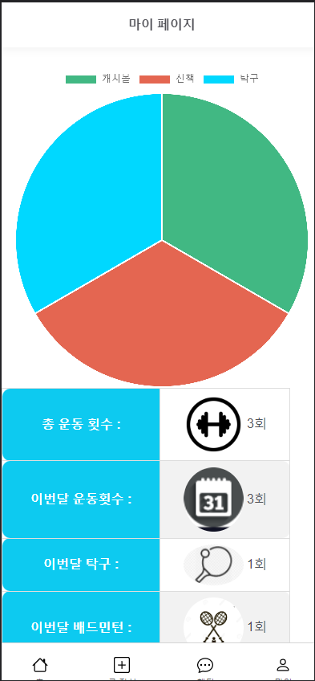

* 마이페이지 운동기록입니다. 운동기록을 확인할 수 있습니다.

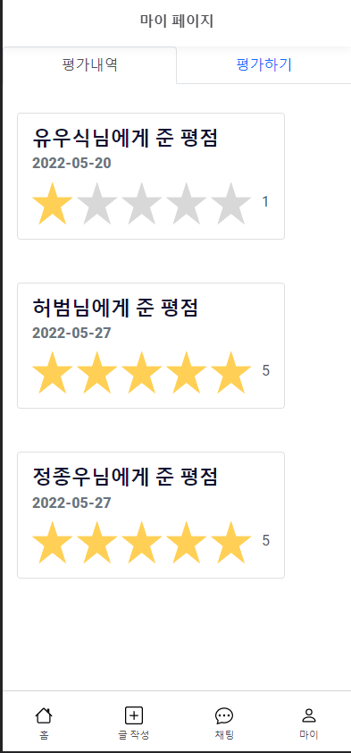

* 평가내역입니다. 그동한 한 평가를 확인 할 수 있습니다.

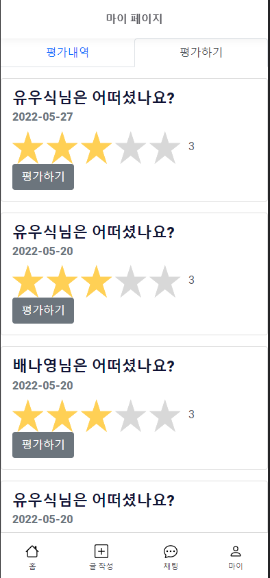

* 평가하기페이지입니다. 운동이 끝나면 크루원들의 평가를 할 수 있습니다.

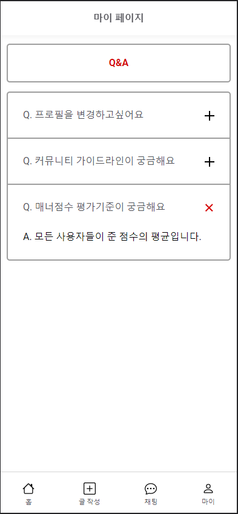

* QNA페이지입니다. QNA를 볼 수 있습니다.
